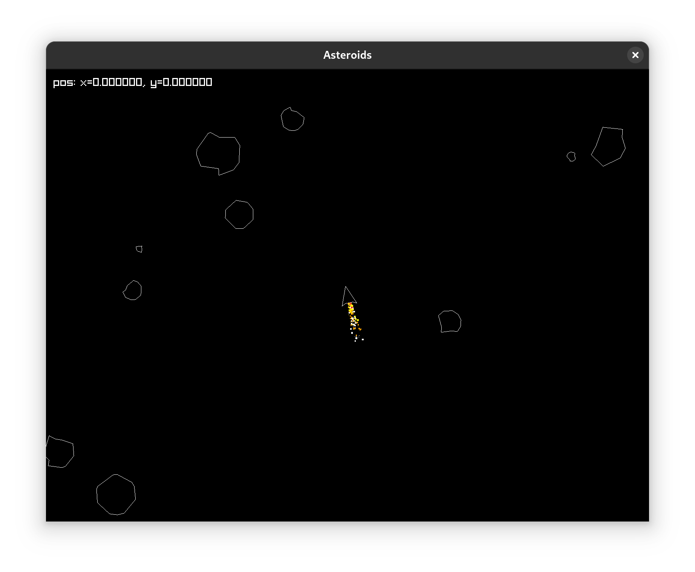
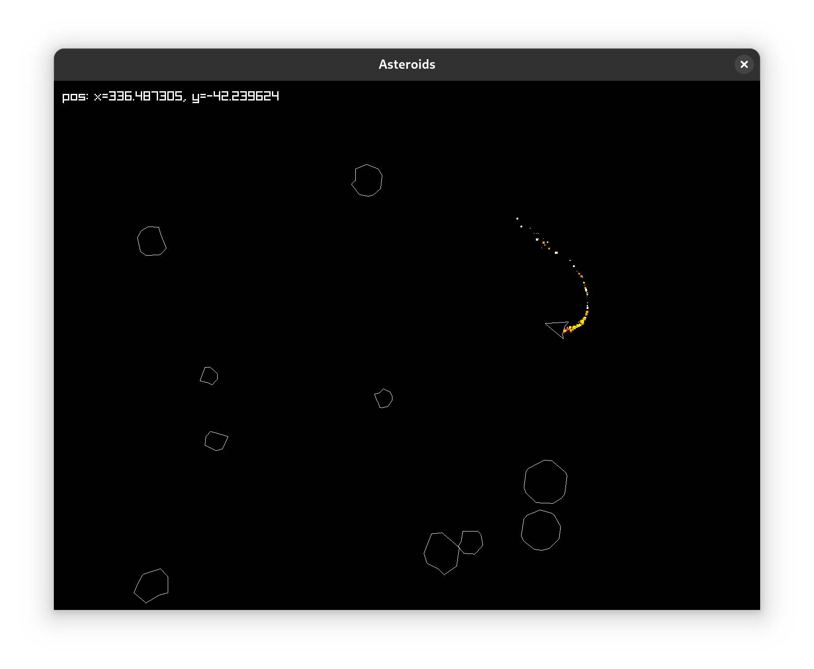

# Asteroids in Zig

That is my first try on Zig language. I decided to dive into without reading much documentation and everything so the code is ugly, but i had much fun writing it.

The project is not completed yet and needs some refactoring but anyway, it's alive :)

### Compile and run

```bash
zig build run
```

### Hotkeys

- `wasd` - ship controls

### Screenshots


